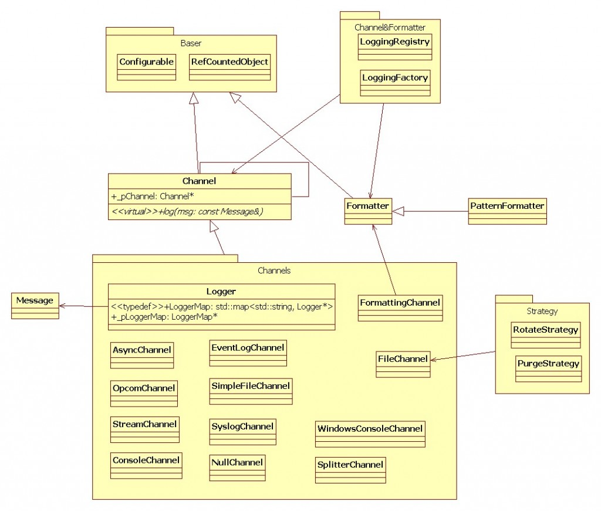
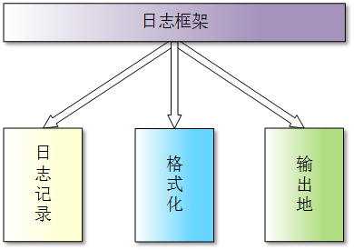
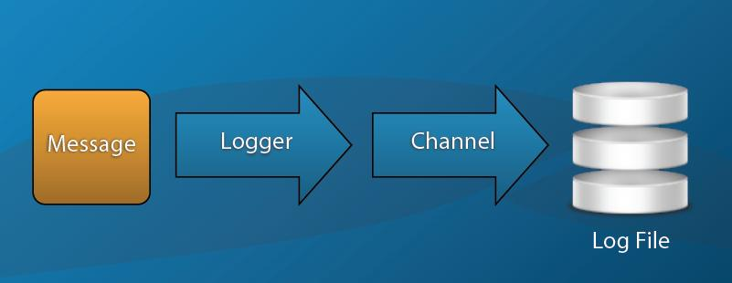
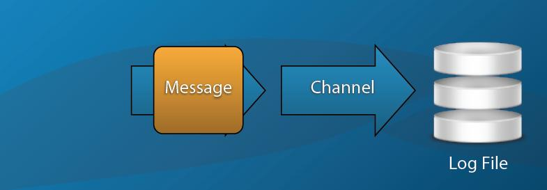
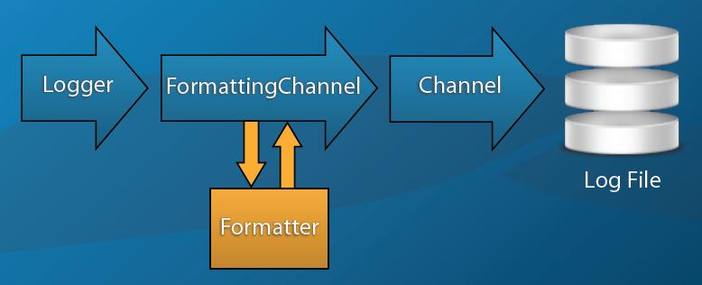

# 日志系统系统的组成
1. Poco::Channel
2. Poco::Formater
3. Poco::Message
## 框架
Poco的日志框架是由Channel类组成的。继承自Channel的子类，调用Message完成消息包的组装，调用Formater完成消息的格式化，然后传递，最后写入文件，syslog，控制台，或流中。整个框架是通过Channel中的log函数和指向下一个Channle的指针完成链接的，有点类似于链表。
  
包Channels中包含各种各样的Channel，消息Message通过这些Channel到达控制台，日志文件等中。FormattingChannel中包含一个Formater，可以对Message进行格式化。FileChannel用于写日志到文件中，其中RotateStrategy和PurgeStrategy用于对日志文件的回滚，清理的策略。Logger是一个用于产生Message的特殊Channel，它是整个链的头。LoggingRegistry和LoggeingFactory是用于产生这些Channels的类。Channel通过Configurable进行配置，包含RefCountedObject，方便AutoPtr进行操作。

## 最简单的使用
```
#include "Poco/Logger.h"
#include "Poco/AutoPtr.h"
#include "Poco/ConsoleChannel.h"

int main()
{
    /* 1.获取 root logger */
    auto &logger = Poco::Logger::root();

    /* 2.设置管道 */
    Poco::AutoPtr<Poco::ConsoleChannel> consoleChannel(new Poco::ConsoleChannel);
    logger.setChannel(consoleChannel);

    /* 3.打印日志 */
    poco_error(logger, "This is an error message");

    return 0;
}
```

## 自定义message
当前仅支持std::string自定义参数，因此，如果值为数字，则必须进行转换。
```
#include "Poco/Logger.h"
#include "Poco/AutoPtr.h"
#include "Poco/PatternFormatter.h"
#include "Poco/FormattingChannel.h"
#include "Poco/ConsoleChannel.h"
#include "Poco/Message.h"

using namespace Poco;

int main()
{
    Message msg;
    msg.setSource("MySource");
    msg.setText("My message text");
    msg["myParam"] = "My Param";

    AutoPtr<FormattingChannel> pFCConsole = new FormattingChannel(new PatternFormatter("%s: %[myParam], %t"));
    pFCConsole->setChannel(new ConsoleChannel);
    pFCConsole->open();

    Logger& consoleLogger = Logger::root(); // or whatever your logger is
    consoleLogger.setChannel(pFCConsole);
    consoleLogger.log(msg);

    return 0;
}
```
## 利用Formatter格式化输出
```
#include "Poco/Logger.h"
#include "Poco/AutoPtr.h"
#include "Poco/ConsoleChannel.h"
#include "Poco/PatternFormatter.h"
#include "Poco/FormattingChannel.h"

int main()
{
    /* 1.获取 root logger */
    auto &logger = Poco::Logger::root();

    /* 2.设置管道 */

    /* 2.1 创建控制台管道 */
    Poco::AutoPtr<Poco::ConsoleChannel> consoleChannel(new Poco::ConsoleChannel);

    /* 2.2 创建 Formatter */
    // 关于格式化控制符的说明可以参见 PatternFormatter.h 中的描述
    Poco::AutoPtr<Poco::PatternFormatter> patternFormatter(
            new Poco::PatternFormatter("[%H:%M:%S] [%U(%u)] %p: %t"));
    patternFormatter->setProperty("times", "local");  // 格式化中的时间显示为本地时间

    /* 2.3 创建 Formatting Channel */
    Poco::AutoPtr<Poco::FormattingChannel> formattingChannel(
            new Poco::FormattingChannel(patternFormatter, consoleChannel));

    /* 2.4 将 Formatting Channel 设置给 logger */
    logger.setChannel(formattingChannel);

    /* 3.打印日志 */
    poco_error(logger, "This is an error message");

    return 0;
}
```
## 从property配置文件读取配置
关于如何写配置文件请见 LoggingConfigurator.h 中的描述。
关于如何写 FileChannel 请见 FileChannel.h 中的描述。

log_conf.propeties内容如下：
```


// 定義了一個formatter，就是定義了日誌的輸出格式
logging.formatters.f1.class = PatternFormatter  
logging.formatters.f1.pattern = [%H:%M:%S] [%U(%u)] %p: %t
logging.formatters.f1.times = local

// 定義了一個輸出通道，輸出的Console控制檯，輸出格式就是上面定一個的f1
logging.channels.c1.class = ConsoleChannel
logging.channels.c1.formatter = f1

// 定義了另一個輸出通道，輸出到檔案，檔名是message.log, 輸出格式也是f1，daily意思是每天寫一個檔案。當然還可以設定檔案大小，儲存天數等
logging.channels.c2.class = FileChannel
logging.channels.c2.path = message.log
logging.channels.c2.formatter = f1
logging.channels.c2.rotation = 10K // 这里也可以是daily, 即每天一个
logging.channels.c2.archive = timestamp
logging.channels.c2.times = local
logging.channels.c2.purgeCount = 10
logging.channels.c2.compress = true

// 把前面定義的兩個輸出通道組合起來，成為一個splitter的通道
logging.channels.splitter.class = SplitterChannel
logging.channels.splitter.channels = c1, c2


// 將splitter通道設定為日誌root的通道，這樣輸出的日誌會通過splitter分別送到console和file。最後定義日誌輸出級別為debug.
logging.loggers.root.channel = splitter
logging.loggers.root.level = debug
```
```
#include "Poco/AutoPtr.h"
#include "Poco/Util/PropertyFileConfiguration.h"
#include "Poco/Util/LoggingConfigurator.h"
#include "Poco/Exception.h"
#include "Poco/Logger.h"
#include <iostream>
using namespace std;
int main()
{
    try
    {
        Poco::AutoPtr<Poco::Util::PropertyFileConfiguration> propertyFileConfiguration(
                new Poco::Util::PropertyFileConfiguration("log_conf.propeties"));

        Poco::Util::LoggingConfigurator().configure(propertyFileConfiguration);
    }
    catch (Poco::Exception &e)
    {
        std::cout << e.displayText() << std::endl;
        return -1;
    }

    auto &logger = Poco::Logger::root();

    poco_error(logger, "This is an error message");
    poco_debug(logger, "This is a debug message");
    poco_fatal(logger, "This is a fatal error!");

    return 0;
}
```

## 从xml配置文件读取配置
log_conf.xml
```
<config>
    <logging>
        <channels>
            <c1>
                <class>FileChannel</class>
                <path>xmllog.log</path>
                <rotation>100 M</rotation>
                <archive>timestamp</archive>
                <compress>true</compress>
                <formatter>
                    <class>PatternFormatter</class>
                    <pattern>%L%d-%m-%Y;%H:%M:%S;%s(%U [%u] );[%p %I];%t</pattern>
                </formatter>
            </c1>
            <c2>
                <class>ColorConsoleChannel</class>
                <pattern>%s(%U [%u]): [%p %I] %t</pattern>
            </c2>
            <splitter>
                <class>SplitterChannel</class>
                <channels>c1,c2</channels>
            </splitter>
        </channels>
        <loggers>
            <root>
                <channel>splitter</channel>
                <level>information</level>
            </root>
        </loggers>
    </logging>
</config>
```
```
#include "Poco/AutoPtr.h"
#include "Poco/Util/XMLConfiguration.h"
#include "Poco/Util/LoggingConfigurator.h"
#include "Poco/Exception.h"
#include "Poco/Logger.h"
#include <iostream>
using namespace std;
int main()
{
    try
    {
        Poco::AutoPtr<Poco::Util::XMLConfiguration> propertyFileConfiguration(
                new Poco::Util::XMLConfiguration("log_conf.xml"));

        Poco::Util::LoggingConfigurator().configure(propertyFileConfiguration);
    }
    catch (Poco::Exception &e)
    {
        std::cout << e.displayText() << std::endl;
        return -1;
    }

    auto &logger = Poco::Logger::root();

    poco_error(logger, "This is an error message");
    poco_debug(logger, "This is a debug message");
    poco_fatal(logger, "This is a fatal error!");

    return 0;
}
```

# 另一个使用app配置的案例
我们通过继承Poco::ServerApplication类可以很方便地实现自己的服务类的代码，Poco::ServerApplication类又继承了Application类，通过Application类可以方便地管理自己实现的每一个SubSystem类，只需要在服务器类的构造函数执行的时候，通过调用addSubsystem()方法就可以了.下面提供一个简易的框架代码
```
    class myServer:public Poco::Util::ServerApplication  
    {  
    myServer()  
    {  
    //构造函数中可以去添加自己实现的Subsystem类  
    addSubsystem(new mySubsystem);  
    }  
    //析构函数  
    virtual ~myServer(){}  
    //以下几个方法是继承自Application类的方法，是需要自己去实现  
    //这个初始化函数的执行会在自己的构造函数之前，在这个位置去读取配置文件,由于Application是单例模式，因此在此位置获取的配置信息可以在程序的任何地方获得，这是一个非常使用的功能  
    void initialize(Application& self)  
    {  
    Poco::Util::Application::loadConfiguration("/path");  
    Poco::Util::ServerApplication::initialize(self);  
    logger().information("starting up",__FILE__,__LINE__);  
    }  
    void uninitialize()  
    {  
    ServerApplication::uninitialize();  
      
    }  
    //下边的三个函数，可以定义一些命令行的操作  
    void defineOptions(Poco::Util::OptionSet& options);  
      
    void handleOption(const std::string& name, const std::string& value);  
      
    void handleHelp(const std::string& name, const std::string& value);  
      
    void displayHelp();  
    //这个是我们要实现的server需要执行的代码  
    int main(const std::vector<std::string>& args)  
    {  
    //Start()方法是自己实现的，这个位置是调用subsystem的线程执行方法  
    getSubsystem<mySubsystem>().Start();  
    // wait for CTRL-C or kill  
    waitForTerminationRequest();  
    //这是程序终止后要做的工作，Stop()方法是自己实现的，这个位置是调用subsystem的线程结束的时候，做的一些后续处理工作  
    getSubsystem<mySubsystem>().Stop();  
    return Application::EXIT_OK;  
    }  
    }  
    //最后我们通过一个宏定义启动我们的服务器  
    POCO_SERVER_MAIN(myServer)  
```
下面我要说的是，Application的Logger&logger() const;方法，因为我们通过load配置信息后，可以很方便的获得日志的配置信息，这样就可以直接实现日志功能，简直是方便的不要不要的。
下面提供一个Poco官网提供的日志配置的代码
https://pocoproject.org/docs/Poco.Util.LoggingConfigurator.html  
参考这个网址，我做了稍微的改动
```
    //这个是对formatter的配置  
    logging.formatters.f1.class = PatternFormatter  
    logging.formatters.f1.pattern = %s: [%p] %t  
    logging.formatters.f1.times = UTC  
    //这是对于channel的配置，由于c1是ConsoleChannel所以不需要配置路径  
    //我们把c2的formatter也配置成f1  
    logging.channels.c1.class = ConsoleChannel  
    logging.channels.c1.formatter = f1  
    logging.channels.c2.class = FileChannel  
    logging.channels.c2.path = ${system.tempDir}/sample.log  
    logging.channels.c2.formatter = f1  
    //只有root可以直接使用，其余的logger是需要定义名字的,我们l1的channel配置成c2  
    logging.loggers.root.channel = c1  
    logging.loggers.root.level = warning  
    logging.loggers.l1.name = logger1  
    logging.loggers.l1.channel = c2  
    logging.loggers.l1.level = information  
```
好了，那么回到服务器的代码，当我们在void initialize(Application& self)函数中完成了加载配置文件之后，通过logger()函数就可以得到配置文件的logger，默认的是root的那个logger，只能够使用一个配置信息，那么我们在配置文件中配置了另外一个logger ——logging.loggers.l1.name = logger1怎么拿到呢，很简单，通过logger().get(“logger1”)就可以得到了，这样非常方便，我们只需要，在主线程中配置好配置信息，然后，每一个subsystem子线程，去拿到不同的logger去打印属于自己的不同的日志信息就可以了。

# 配置文件参考
```
#Configuring Formatters
#
#A formatter is configured using the "logging.formatters" property. Every 
#formatter has an internal name, which is only used for referring to it 
#during configuration time. This name becomes part of the property name.
#Every formatter has a mandatory "class" property, which specifies the actual
#class implementing the formatter. Any other properties are passed on to
#the formatter by calling its setProperty() method.
#
#A typical formatter definition looks as follows:
#     logging.formatters.f1.class = PatternFormatter
#     logging.formatters.f1.pattern = %s: [%p] %t
#     logging.formatters.f1.times = UTC
logging.formatters.f1.class = PatternFormatter  
logging.formatters.f1.pattern = [%Y-%m-%d %H:%M:%S] [%U(%u)] %s:%p:%t

#Configuring Channels
#
# A channel is configured using the "logging.channels" property. Like with
# Formatters, every channel has an internal name, which is used during
# configuration only. The name becomes part of the property name.
# Every channel has a mandatory "class" property, which specifies the actual
# class implementing the channel. Any other properties are passed on to
# the formatter by calling its setProperty() method.
#
# For convenience, the "formatter" property of a channel is treated
# specifically. The "formatter" property can either be used to refer to
# an already defined formatter, or it can be used to specify an "inline"
# formatter definition. In either case, when a "formatter" property is
# present, the channel is automatically "wrapped" in a FormattingChannel
# object.
# 
# Similarly, a channel supports also a "pattern" property, which results
# in the automatic instantiation of a FormattingChannel object with a
# connected PatternFormatter.
# 
# Examples:
#     logging.channels.c1.class = ConsoleChannel
#     logging.channels.c1.formatter = f1
#     logging.channels.c2.class = FileChannel
#     logging.channels.c2.path = ${system.tempDir}/sample.log
#     logging.channels.c2.formatter.class = PatternFormatter
#     logging.channels.c2.formatter.pattern = %s: [%p] %t
#     logging.channels.c3.class = ConsoleChannel
#     logging.channels.c3.pattern = %s: [%p] %t

#向控制台输出
logging.channels.c1.class = ConsoleChannel  
logging.channels.c1.formatter = f1  


#向文件输出  
logging.channels.c2.class = FileChannel  
logging.channels.c2.formatter = f1 

#The following properties are supported:
#       * path:         The log file's path.
#       * rotation:     The log file's rotation mode. See the 
#                       FileChannel class for details.
#       * archive:      The log file's archive mode. See the
#                       FileChannel class for details.
#       * times:        The log file's time mode. See the
#                       FileChannel class for details.
#       * compress:     Enable or disable compression of
#                       archived files. See the FileChannel class
#                       for details.
#       * purgeAge:     Maximum age of an archived log file before
#                       it is purged. See the FileChannel class for
#                       details.
#       * purgeCount:   Maximum number of archived log files before
#                       files are purged. See the FileChannel class
#                       for details.
#       * flush:        Specifies whether messages are immediately
#                       flushed to the log file. See the FileChannel class
#                       for details.
#       * rotateOnOpen: Specifies whether an existing log file should be 
#                       rotated and archived when the channel is opened.

#path:The log file's path. 
logging.channels.c2.path = ./sample.log  

#The log file's rotation mode.
#follwing values:
#           * never:         no log rotation
#           * [day,][hh]:mm: the file is rotated on specified day/time
#                   day - day is specified as long or short day name (Monday|Mon, Tuesday|Tue, ... );
#                          day can be omitted, in which case log is rotated every day
#                   hh  - valid hour range is 00-23;
#                         hour can be omitted, in which case log is rotated every hour
#                   mm  - valid minute range is 00-59;
#                         minute must be specified
#           * daily:         the file is rotated daily
#           * weekly:        the file is rotated every seven days
#           * monthly:       the file is rotated every 30 days
#           * <n> minutes:   the file is rotated every <n> minutes, 
#                   where <n> is an integer greater than zero.
#           * <n> hours:     the file is rotated every <n> hours, where
#                   <n> is an integer greater than zero.
#           * <n> days:      the file is rotated every <n> days, where
#                   <n> is an integer greater than zero.
#           * <n> weeks:     the file is rotated every <n> weeks, where
#                   <n> is an integer greater than zero.
#           * <n> months:    the file is rotated every <n> months, where
#                   <n> is an integer greater than zero and
#                   a month has 30 days.
#           * <n>:           the file is rotated when its size exceeds
#                   <n> bytes.
#           * <n> K:         the file is rotated when its size exceeds
#                   <n> Kilobytes.
#           * <n> M:         the file is rotated when its size exceeds
#                   <n> Megabytes.
logging.channels.c2.rotation = 50 M

#The following values
#for the "archive" property are supported:
#
#           * number:     A number, starting with 0, is appended to
#                the name of archived log files. The newest
#                archived log file always has the number 0.
#                For example, if the log file is named
#                "access.log", and it fulfils the criteria
#                for rotation, the file is renamed to
#                "access.log.0". If a file named "access.log.0"
#                already exists, it is renamed to "access.log.1",
#                and so on.
#           * timestamp:  A timestamp is appended to the log file name.
#                For example, if the log file is named
#                "access.log", and it fulfils the criteria
#                for rotation, the file is renamed to
#                "access.log.20050802110300".
logging.channels.c2.archive = timestamp


#Using the "times" property it is possible to specify
#time mode for the day/time based rotation. The following values
#for the "times" property are supported:
#
#           * utc:        Rotation strategy is based on UTC time (default).
#           * local:      Rotation strategy is based on local time.
#logging.channels.c2.times = utc


#Archived log files can be compressed using the gzip compression
#method. Compressing can be controlled with the "compress"
#property. The following values for the "compress" property
#are supported:
#
#           * true:       Compress archived log files.
#           * false:      Do not compress archived log files.
logging.channels.c2.compress = false 


#Archived log files can be automatically purged, either if
#they reach a certain age, or if the number of archived
#log files reaches a given maximum number. This is 
#controlled by the purgeAge and purgeCount properties.
#
#The purgeAge property can have the following values:
#
#       * <n> [seconds]: the maximum age is <n> seconds.
#       * <n> minutes:   the maximum age is <n> minutes.
#       * <n> hours:     the maximum age is <n> hours.
#       * <n> days:      the maximum age is <n> days.
#       * <n> weeks:     the maximum age is <n> weeks.
#       * <n> months:    the maximum age is <n> months, where a month has 30 days.
logging.channels.c2.purgeAge = 30 days 


#The purgeCount property has an integer value that specifies the maximum number
#of archived log files. If the number is exceeded, archived log files are
#deleted, starting with the oldest. When "none" or empty string are
#supplied, they reset purgeCount to none (no purging). 
logging.channels.c2.purgeCount = 60  


#The flush property specifies whether each log message is flushed
#immediately to the log file (which may hurt application performance,
#but ensures that everything is in the log in case of a system crash),
#or whether it's allowed to stay in the system's file buffer for some time. 
#Valid values are:
#
#       * true:  Every essages is immediately flushed to the log file (default).
#       * false: Messages are not immediately flushed to the log file.
#logging.channels.c2.flush = true  


#The rotateOnOpen property specifies whether an existing log file should be 
#rotated (and archived) when the channel is opened. Valid values are:
#
#       * true:  The log file is rotated (and archived) when the channel is opened.
#       * false: Log messages will be appended to an existing log file,
#           if it exists (unless other conditions for a rotation are met). 
#           This is the default.
#logging.channels.c2.rotateOnOpen = false 


#空通道，发送到这个通道的message都不输出
logging.channels.c3.class = NullChannel 
logging.channels.c3.formatter = f1


logging.channels.splitter.class = SplitterChannel  
logging.channels.splitter.channels = c1,c2,c3


# Configuring Loggers
#
# A logger is configured using the "logging.loggers" property. Like with
# channels and formatters, every logger has an internal name, which, however,
# is only used to ensure the uniqueness of the property names. Note that this
# name is different from the logger's full name, which is used to access
# the logger at runtime.
# Every logger except the root logger has a mandatory "name" property which
# is used to specify the logger's full name.
# Furthermore, a "channel" property is supported, which can either refer
# to a named channel, or which can contain an inline channel definition.
#
# Examples:
#     logging.loggers.root.channel = c1
#     logging.loggers.root.level = warning
#     logging.loggers.l1.name = logger1
#     logging.loggers.l1.channel.class = ConsoleChannel
#     logging.loggers.l1.channel.pattern = %s: [%p] %t
#     logging.loggers.l1.level = information  
logging.loggers.root.channel = splitter  
logging.loggers.root.level = debug  
```


# 何为日志框架

    日志框架：一个经过专门设计的实用程序，用于规范应用程序的日志记录过程。

日志框架可以自己编写（技术要牛才行哦），也可以由第三方（例如：log4cplus）提供。对于不同的日志框架，各自的组织在实现方式上也有所不同。

虽然可以简单地“标准化”日志（例如：调用文件系统 API，将信息写入名为 log.txt 的文件），但是要成为一个严格意义上的框架，必须要超越标准化。也就是说，日志框架必须通过处理日志记录来标准化解决方案，从而暴露一个标准的 API。
没明白？那就再具体一些，设想一个日志框架，封装了三个主要部分：  

  

当想要捕获程序的运行时信息时，首先要发出要记录的信息。然后，格式化这些信息。最后，决定将它输出到哪里。一般情况下，会输出到文件中，但是也可以将其输出到控制台、数据库，或者任何能够接收数据的地方。

如果有一系列代码，能够解决这些问题，那么就可以被看作是一个日志框架。
为什么不是 cout

    使用日志，只为成为更好的攻城狮。

也许有人会问：既然 C++ 中有 cout，为什么还要使用日志呢？

无法否认，在使用像 C++、Java、PHP 这样的编程语言时，我们会经常将消息打印到控制台，因为这是开发、测试和调试程序的一部分。但倘若我们正在处理一个服务端程序，却无法看到其内部发生了什么，这时该怎么办？唯一的可见性工具是日志文件，如果没有日志，我们就不能进行任何调试，也无法知道程序内部在做什么。

尽管 C++ 中有相当方便的 cout 输出流，可以在控制台上打印一些信息，或者可以通过其他方式将这些信息重定向到文件中，但这对于实际的应用程序来说根本不够。尤其对于复杂的 C++ 程序来说，像 log4cplus 或任何其他日志框架能够提供了更多的灵活性，而这是 cout 不可能完成的。

在编写代码时，使用日志框架是一种很好的实践。即使像《代码整洁之道》这样的书籍，也建议学习像 Log4j 这样的框架进行日志记录。所以，请尽可能的在生产代码中使用日志，而不是用 cout 来打印东西（这是不可接受的）。
使用日志的好处

    日志是一个优秀系统不可或缺的组成部分。

对于很多人来说，日志的作用仅限于调试。其实不然，它在很多方面都非常有用：

    日志是最好的的诊断工具

绝大多数人都曾面临这样的困境——一旦程序出现问题，很长时间都找不出原因！

缺少日志，我们将不得不依赖于客户或支持团队，让他们描述在什么情况下发生了什么（很可能会存在一些误导）。随后我们需要通过开发环境重现问题，并进行各种调试，直至错误修复为止，然而这一般会耗费很长时间。但若有日志的帮助，我们便能迅速摆脱这种困境，可以很快地发现异常，并快速定位、解决问题！

    日志让我们有机会检测模块的瓶颈

随着项目规模的增加，模块会越来越多，调优也变成了一场持久战。

通过记录某些操作的日期和时间，我们可以及时地检测模块的瓶颈，并针对性地对一些耗时操作做出优化。

    日志有助于我们了解用户行为

为了提高产品质量，提供个性化服务，就必须了解用户行为——他们做了什么，想要什么。

要搞清楚这些，当然要有数据，所以需要采集和分析用户的行为，而日志无疑是最主要的数据来源。


# Poco库日志接口
## 总体介绍 

         Poco中的日志模块主要涉及下列几个部分。
          1. 消息，日志和通道
          2. 格式
          3. 执行效率的考量

          模块框架图：
  
 
 
 
## 消息(Message类)：
          1. 所有的消息都被存储并通过类Poco::Message传递
          2. 一个消息包括了下述特性：
             a. 优先级
             b. 消息源
             c. 消息内容
             d. 时间戳
             e. 进程与线程标记
             f. 可选参数(名字-值)对

          消息优先级：
           Poco定义了8种消息优先级:
                PRIO_FATAL
                PRIO_CRITICAL
                PRIO_ERROR
                PRIO_WARNING
                PRIO_NOTICE
                PRIO_INFORMATION
                PRIO_DEBUG
                PRIO_TRACE
          可以通过函数设置和获取消息优先级：

                    void setPriority(Priority prio)
                    Priority getPriority() const


          消息源：
          消息源用来描述日志消息的源。通常状态下，使用Poco::Logger的名字来命名。因此应该合理的命名Poco::Logger的名字。
          可以通过函数设置和获取消息源：

                    void setSource(const std::string& source)
                    const std::string& getSource() const 


   
          消息内容：
          在Poco中消息内容是不考虑格式和长度等问题的，只是消息内容。当消息最终输出时，消息内容有可能被类Poco::formatter修改。
          可以通过函数设置和获取消息内容：

                    void setText(const std::string& text)
                    const std::string& getText() const


          消息时间戳：
          记录消息产生时的时间戳，精度为毫秒。
          可以通过函数设置和获取时间戳：  

                    void setTime(const Timestamp& time)

     进程和线程标识符：
          进程标识符(PID)为长整形的int值，用来存储系统的进程ID。
          线程标识符(TID)同样为长整形的int值，用于存储当前线程的ID值。
          同样的当前线程的名字也会被存储。进程标识符(PID)、线程标识符(TID)、线程名在Poco::Message初始化时会自动生成。
          可以使用下列函数对进程标识符(PID)、线程标识符(TID)、线程名进行操作：

                 void setThread(const std::string& threadName)
                 const std::string& getThread() const
                 void setTid(long tid)
                 long getTid() const
                 void setPid(long pid)
                 long getPid() const


          消息参数：
          一个消息可以存储任意数目的name-value对 。
          name-value可以是任意字符串。
          消息参数可以被用于最终的格式输出。
          消息参数支持下标索引。
 Message类提供了非常多的存储选项(见Message类的头文件)，有日志的源、线程信息、进程信息、优先级等。在此基础上，为了满足用户的需求，还放了一个map来支持用户定制。所有的信息，都在Message类构造的时候被赋值，真的挺强大。当然这一做法也会带来一点程序上的开销。

 ## Logger类
Logger是个接口类，它主要有3个功能：
1. 它是一个Logger对象的工厂。调用静态函数get(const std::string& name)可以获得对应的Logger对象。
2. 它实现了日志逻辑上的继承体系。在其内部定义了一个静态变量_pLoggerMap。  
   static std::map<std::string, Logger*>* _pLoggerMap;
    这个静态变量管理了所有的日志对象。
3. 用户接口  
调用Logger对象的接口函数会触发其内部Channel对象的对应接口函数。比如说日志的记录动作


          应用程序可以使用Poco::Logger类去产生日志消息。每一个日志对象内部都包含了一个通道对象(Channel)，通道用于最终把消息送到目的地。
          每一个logger对象都有名字，logger对象的名字会被用于命名所有由此对象产生的消息的消息源名称。名字一旦被设定，将不能被改变。
          每一个Poco::Logge对象都有其自己的优先级。有了优先级后，Poco::Logge对象便可以对消息进行过滤。只有消息的优先级比Poco::Logge对象的优先级高，消息才会被Poco::Logge对象所传递。

          Logger的继承体系。
          1. 基于Logger的名字，可以形成日志的树状继承体系。
          2. 一个Logger对象的名字包含了一个或多个部分，不同部分之间使用'.'分隔。每个日志组件的名称都包含了上级日志组件的名称
          3. 存在一个特殊的Logger，即root Logger，其名字为空。它是所有Logger的根。
          4. 对于Logger继承的深度Poco库并没有限制。

          下面是对于Logger继承的一个说明：
          Logger Hierarchy Example
             |
             |---- "" (the root logger)
                |
                |-----"HTTPServer"
                    |
                    |-----"HTTPServer.RequestHandler"
                    |
                    |-----"HTTPServer.RequestHandler.File"
                    |
                    |-----"HTTPServer.RequestHandler.CGI"
                    |
                    |------"HTTPServer.Listener"

          说明：
         3. 一个新的logger将继承它的上级日志组件的级别和通道。比如说，上例中"HTTPServer.RequestHandler.CGI"会继承"HTTPServer.RequestHandler"的日志级别和通道。
          1. 一旦一个logger被完全创建，它就将与它的上级无关。完全创建指，logger拥有自己的channel和日志级别，而不是和其它logger共用。换句话说，改变日志级别和通道将不会影响的到其他的已经存在的logger对象。
          2. 尽可能的对日志对象一次设置所有的参数，比如说日志级别和通道。

          记录消息：
          1. void log(const Message& msg)
          如果消息的优先级高于或者等于logger的优先级，消息将被传递到logger对应的通道中。消息传递时并不会发生改变。
          1. void log(const Exception& exc)
          使用最高优先级PRIO_ERROR，创建并记录消息。消息内容为异常内容。
          1. 使用下列不同优先级和给定的文字创建并记录消息

           void fatal(const std::string& text)
           void critical(const std::string& text)
           void error(const std::string& text)
           void warning(const std::string& text)   
           void notice(const std::string& text)
           void information(const std::string& text)
           void debug(const std::string& text)
           void trace(const std::string& text)

          2. 使用给定的优先级和内容记录消息。消息的内容为16进制的给定Dump数据块。
             Logging Messages (cont'd)
          3. 判断日志等级
             bool is(int level) const
             如果logger的日志级别等于或高于查询的日志级别，返回true

           bool critical() const
           bool error() const
           bool warning() const
           bool notice() const
           bool information() const
           bool debug() const
           bool trace() const
           bool fatal() const

            如果logger的日志级别等于或高于给定的日志级别，返回true

          访问日志对象：
          POCO库在内部管理了一个全局的日志map。用户不需要自己创建logger对象，用户可以向POCO库申请一个logger对象的引用。POCO会根据需要创建新的日志对象。
          static Logger& get(const std::string& name)
          使用上面函数可以获取到给定名称所关联的logger对象的引用，如果有必要，POCO库会在内部创建一个logger对象。出于效率上的考虑，Poco使用文档推荐用户保存所使用的logger对象的引用，而不是频繁的调用此函数。理所当然的，POCO库能保证logger对象的引用始终有效。

          下面是一个例子：
```
    #include "Poco/Logger.h"
    using Poco::Logger;
    int main(int argc, char** argv)
    {
              Logger& logger = Logger::get("TestLogger");
              logger.information("This is an informational message");
              logger.warning("This is a warning message");
              return 0;
    } 
```
## 通道:
Channel类  
Channel类可以被看成为所有输出对象的抽象，它也是个抽像类。它继承自Configurable和RefCountedObject。继承自Configurable说明需要对配置信息进行一定的解析工作，继承自RefCountedObject说明其本身是个引用计数对象，会使用AutoPtr去管理。
其具体定义如下：
```
class Foundation_API Channel: public Configurable, public RefCountedObject
{
public:
	Channel();
	virtual void open();
		
	virtual void close();		
	virtual void log(const Message& msg) = 0；		
	void setProperty(const std::string& name, const std::string& value);
	std::string getProperty(const std::string& name) const;
		
protected:
	virtual ~Channel();
	
private:
	Channel(const Channel&);
	Channel& operator = (const Channel&);
};
```
   Poco内部实现了非常多的Channel子类，被用于向不同的目标输出日志信息。很多Channel是依赖于平台的，如EventLogChannel、SyslogChannel、OpcomChannel、WindowsConsoleChannel。它们都实现单一功能即向一个特殊的目标输出。


          通道的子类负责传递消息给最终目的地。比如说控制台或者日志文件等。
          每一个 Poco::Logger类对象(它本身也是Poco::Channel的子类)都对应着一个Poco::Channel类对象。在Poco库内部已经实现了各种Poco::Channel子类，用于向不同的目标输出日志，比如说控制台，日志文件，或者系统日志工具。用户可以定义自己的channel类。在内部Poco::Channel使用了引用计数技术来实现内存管理。

          通道属性:
          通道支持配置任意数目的属性，属性为一个名字值对。属性可以通过以下函数获取和设置：

                 void setProperty(const std::string& name, const std::string& value)
                 std::string getProperty(const sdt::string& name)

这两个函数被定义在Poco::Configurable中，Poco::Configurable为Poco::Channel的父类。
Configurable类是用来对日志特性做配置的（见头文件），它本身是一个抽象类，提供了两个接口，用来设置和获取日志属性。看子类的代码，能够知道，这两个接口是用来完成字符解析工作的。

1. 控制台通道(ConsoleChannel)  
          Poco::ConsoleChannel可以满足大多数的控制台输出。它只是简单的把消息内容写入了标准输出流(std::clog)，并且不支持配置属性。它是根logger默认关联的通道（貌似这里有点误解，根logger并不会自动创建ConsoleChannel）。

2. windows控制台通道(WindowsConsoleChannel)  
          Poco::WindowsConsoleChannel同ConsoleChannel类似，唯一不同的是向windows控制台输出。它只是简单把消息内容写入window控制台，并且不支持配置属性。向window控制台输出时，支持UTF-8编码。

3. 空白通道(NullChannel)  
          Poco::NullChannel通道会抛弃所有发向它的消息，并且忽略所有setProperty()函数设置的属性。
4. 简单文件通道(SimpleFileChannel)  
          Poco::SimpleFileChannel类实现了向日志文件输出的简单功能。对于每一个消息，其内容都会被添加到文件中，并使用一个新行输出。简单日志文件支持文件循环覆盖，一旦主日志文件超过确定的大小，第二个日志文件会被创建，如果第二个日志文件已经存在，会被截断。而当第二个日志文件超过大小限制，主日志文件将被覆盖。如此循环。

          简单文件通道属性
          path: 主日志文件路径
          secondaryPath: 第二个日志文件路径。默认同主日志文件路径。
          rotation：日志循环覆盖模式。可以有以下几种选择:
               never: 不需要循环覆盖
               <n>: 如果超过 <n> 字节的话，循环覆盖
               <n> K: 如果超过 <n> K字节的话，循环覆盖
               <n> M: 如果超过 <n> M字节的话，循环覆盖

          下面是一个例子：
```
    #include "Poco/Logger.h"
    #include "Poco/SimpleFileChannel.h"
    #include "Poco/AutoPtr.h"
    using Poco::Logger;
    using Poco::SimpleFileChannel;
    using Poco::AutoPtr;
    int main(int argc, char** argv)
    {
              AutoPtr<SimpleFileChannel> pChannel(new SimpleFileChannel);
              pChannel->setProperty("path", "sample.log");
              pChannel->setProperty("rotation", "2 K");
              Logger::root().setChannel(pChannel);
              Logger& logger = Logger::get("TestLogger"); // inherits root channel
              for (int i = 0; i < 100; ++i)
              logger.information("Testing SimpleFileChannel");
              return 0;
    }
```

5. 文件通道  
          Poco::FileChannel类提供了完整的日志支持。每一个消息的内容都会被添加到文件中，并使用一个新行输出。Poco::FileChannel类支持按文件大小和时间间隔对日志进行循环覆盖，支持自动归档（使用不同的文件命名策略），支持压缩（GZIP）和清除（根据已归档文件的日期或数量）归档日志文件。

          文件通道属性
          path: 日志文件的路径
          rotation：日志循环覆盖模式。可以有以下几种选择:
               never: 不需要循环覆盖
               <n>: 如果超过 <n> 字节的话，循环覆盖
               <n> K: 如果超过 <n> K字节的话，循环覆盖
               <n> M: 如果超过 <n> M字节的话，循环覆盖
               [day][hh:][mm]: 按照指定的日期和时间进行日志的循环覆盖
               daily/weekly/monthly: 按照日/周/月循环覆盖
               <n> hours/weeks/months: 按照<n>小时/周/月进行循环覆盖
          archive：归档日志的目录名
               number:从0开始自动增加的数字，被添加到日志文件名后。最新的日志文件数字总是0。
               timestamp: 时间戳以YYYYMMDDHHMMSS格式被添加到日志文件名后
               times:指定循环的时间是按照本地时间还是按照UTC时间。本地时间和utc时间都是可以接受的合法时间。
               compress：自动压缩存档文件。指定true或者false。
              purgeAge：指定归档日志的最大期限。当日志的生成时间超过此期限，将被删除。格式为 <n> [seconds]/minutes/hours/days/weeks/months
               purgeCount：指定归档日志文件的最大数目。如果生成日志的数目超过此最大数目，生成日期最早的文件将被删除。

# 每次运行log文件名以时间戳命名
```
    #include "Poco/Logger.h"
    #include "Poco/FileChannel.h"
    #include "Poco/AutoPtr.h"
    using Poco::Logger;
    using Poco::FileChannel;
    using Poco::AutoPtr;
    int main(int argc, char** argv)
    {
              AutoPtr<FileChannel> pChannel(new FileChannel);
              pChannel->setProperty("path", "sample.log");
              pChannel->setProperty("rotation", "2 K");
              pChannel->setProperty("archive", "timestamp");
              Logger::root().setChannel(pChannel);
              Logger& logger = Logger::get("TestLogger"); // inherits root channel
              for (int i = 0; i < 100; ++i)
              logger.information("Testing FileChannel");
              return 0;
    }
```
6. 事件日志通道(EventLogChannel)  
          Poco::EventLogChannel仅被使用于操作系统Windows NT中，它将把日志写到"Windows事件日志"中.Poco::EventLogChannel会把PocoFoundation.dll作为消息定义资源注册到"Windows事件日志"中。当使用Window事件查看器来查看系统事件日志时，事件查看器必须要找到PocoFoundation.dll，否则记录的日志消息将不能够被正常显示。

          事件日志通道属性
               name：事件源的名字，通常是程序名。
               loghost, host：事件日志服务在运行的主机的名称。默认值为本地主机
               logfile:日志文件的名称。默认是应用程序本身。

7. 系统日志通道(SyslogChannel)  
          Poco::SyslogChannel仅适用于Unix平台，会把日志输出到本地系统日志守护程序。
          包含RemoteSyslogChannel类的网络库，可以通过基于UDP的系统日志协议(Syslog protoco)把日志输出到远程的日志守护程序上。

8. 异步通道  
   内部包含一个Thread对象，通过内部NotificationQueue队列，完成了日志生成和输出的解耦。
          Poco::AsyncChannel允许在另外一个分离的线程中去记录通道的日志。这可以把产生日志的线程和记录日志的线程分开而实现解耦。所有的消息先被存储在一个先进先出的消息队列中，然后由一个单独的线程从消息队列中获取，并最终把消息发送到输出通道。
# 异步log案例
 ```
    #include "Poco/Logger.h"
    #include "Poco/AsyncChannel.h"
    #include "Poco/ConsoleChannel.h"
    #include "Poco/AutoPtr.h"
    using Poco::Logger;
    using Poco::AsyncChannel;
    using Poco::ConsoleChannel;
    using Poco::AutoPtr;
    int main(int argc, char** argv)
    {
              AutoPtr<ConsoleChannel> pCons(new ConsoleChannel);
              AutoPtr<AsyncChannel> pAsync(new AsyncChannel(pCons));
              Logger::root().setChannel(pAsync);
              Logger& logger = Logger::get("TestLogger");
              for (int i = 0; i < 10; ++i)
              logger.information("This is a test");
              return 0;
    }
```

9. 拆分通道(SplitterChannel)  
完成了一份消息，多份输出的工作。它本身是一个Channel类的容器  
          使用Poco::SplitterChannel可以把消息发送给一个或者多个其他的通道，即输出日志在多个目标中。使用下面的函数可以在SplitterChannel中加入一个新通道:
                void addChannel(Channel* pChannel)
# 日志记录在终端和文件中
```
    #include "Poco/Logger.h"
    #include "Poco/SplitterChannel.h"
    #include "Poco/ConsoleChannel.h"
    #include "Poco/SimpleFileChannel.h"
    #include "Poco/AutoPtr.h"
    using Poco::Logger;
    using Poco::SplitterChannel;
    using Poco::ConsoleChannel;
    using Poco::SimpleFileChannel;
    using Poco::AutoPtr;
    int main(int argc, char** argv)
    {
              AutoPtr<ConsoleChannel> pCons(new ConsoleChannel);
              AutoPtr<SimpleFileChannel> pFile(new SimpleFileChannel("test.log"));
              AutoPtr<SplitterChannel> pSplitter(new SplitterChannel);
              pSplitter->addChannel(pCons);
              pSplitter->addChannel(pFile);
              Logger::root().setChannel(pSplitter);
              Logger::root().information("This is a test");
              return 0;
    }
```

## LogStream类
Poco::LogStream类提供了一个日志的输出流接口。可以在日志流中，格式化输出日志记录消息。日志消息必须以std::endl(或CR和LF字符)结尾。
下面是 LogStream在日志体系中的示意图：

 消息的优先级可以使用下列函数设定:

              LogStream& priority(Message::Priority prio)
              LogStream& fatal()
              LogStream& critical()
              LogStream& error()
              LogStream& warning()
              LogStream& notice()
              LogStream& information()
              LogStream& debug()
              LogStream& trace
下面是一个例子:
实际测试不知道打印到哪去了。。。
```
    #include "Poco/LogStream.h"
    #include "Poco/Logger.h"
    using Poco::Logger;
    using Poco::LogStream;
    int main(int argc, char** argv)
    {
              Logger& logger = Logger::get("TestLogger");
              LogStream lstr(logger);
              lstr << "This is a test" << std::endl;
              return 0;
    }
```

## FormattingChannel类和Formatter类
消息的格式

FormattingChannel类和Formatter类负责格式化日志消息。Poco::FormattingChannel会把它接受到的每一个消息通过Poco::Formatter传递给下一个的输出通道。Poco::Formatter是所有格式类的基类，同通道一样，可以被设置属性。

1. PatternFormatter类  
Poco::PatternFormatter可以根据打印格式去格式化消息。想要知道更多细节，可以查看相关文档。
```
    #include "Poco/ConsoleChannel.h"
    #include "Poco/FormattingChannel.h"
    #include "Poco/PatternFormatter.h"
    #include "Poco/Logger.h"
    #include "Poco/AutoPtr.h"
    using Poco::ConsoleChannel;
    using Poco::FormattingChannel;
    using Poco::PatternFormatter;
    using Poco::Logger;
    using Poco::AutoPtr;
    int main(int argc, char** argv)
    {
              AutoPtr<ConsoleChannel> pCons(new ConsoleChannel);
              AutoPtr<PatternFormatter> pPF(new PatternFormatter);
              pPF->setProperty("pattern", "%Y-%m-%d %H:%M:%S %s: %t");
              AutoPtr<FormattingChannel> pFC(new FormattingChannel(pPF, pCons));
              Logger::root().setChannel(pFC);
              Logger::get("TestChannel").information("This is a test");
              return 0;
    }
```
2. 格式类(Formatter)
格式类是用来确定输出日志最终内容的格式的。Message类提供了非常多的日志信息，但并不是所有信息都是用户所感兴趣的。Formatter被用来确定最终消息输出。在Poco库中内置了一些格式输出选项，由PatternFormatter完成。其定义如下：
```
class Foundation_API PatternFormatter: public Formatter
	/// This Formatter allows for custom formatting of
	/// log messages based on format patterns.
	///
	/// The format pattern is used as a template to format the message and
	/// is copied character by character except for the following special characters,
	/// which are replaced by the corresponding value.
	///
	///   * %s - message source
	///   * %t - message text
	///   * %l - message priority level (1 .. 7)
	///   * %p - message priority (Fatal, Critical, Error, Warning, Notice, Information, Debug, Trace)
	///   * %q - abbreviated message priority (F, C, E, W, N, I, D, T)
	///   * %P - message process identifier
	///   * %T - message thread name
	///   * %I - message thread identifier (numeric)
	///   * %N - node or host name
	///   * %U - message source file path (empty string if not set)
	///   * %u - message source line number (0 if not set)
	///   * %w - message date/time abbreviated weekday (Mon, Tue, ...)
	///   * %W - message date/time full weekday (Monday, Tuesday, ...)
	///   * %b - message date/time abbreviated month (Jan, Feb, ...)
	///   * %B - message date/time full month (January, February, ...)
	///   * %d - message date/time zero-padded day of month (01 .. 31)
	///   * %e - message date/time day of month (1 .. 31)
	///   * %f - message date/time space-padded day of month ( 1 .. 31)
	///   * %m - message date/time zero-padded month (01 .. 12)
	///   * %n - message date/time month (1 .. 12)
	///   * %o - message date/time space-padded month ( 1 .. 12)
	///   * %y - message date/time year without century (70)
	///   * %Y - message date/time year with century (1970)
	///   * %H - message date/time hour (00 .. 23)
	///   * %h - message date/time hour (00 .. 12)
	///   * %a - message date/time am/pm
	///   * %A - message date/time AM/PM
	///   * %M - message date/time minute (00 .. 59)
	///   * %S - message date/time second (00 .. 59)
	///   * %i - message date/time millisecond (000 .. 999)
	///   * %c - message date/time centisecond (0 .. 9)
	///   * %F - message date/time fractional seconds/microseconds (000000 - 999999)
	///   * %z - time zone differential in ISO 8601 format (Z or +NN.NN)
	///   * %Z - time zone differential in RFC format (GMT or +NNNN)
	///   * %E - epoch time (UTC, seconds since midnight, January 1, 1970)
	///   * %[name] - the value of the message parameter with the given name
	///   * %% - percent sign
{
public:
	PatternFormatter();
		/// Creates a PatternFormatter.
		/// The format pattern must be specified with
		/// a call to setProperty.
 
	PatternFormatter(const std::string& format);
		/// Creates a PatternFormatter that uses the
		/// given format pattern.
 
	~PatternFormatter();
		/// Destroys the PatternFormatter.
 
	void format(const Message& msg, std::string& text);
		/// Formats the message according to the specified
		/// format pattern and places the result in text. 
		
	void setProperty(const std::string& name, const std::string& value);
		/// Sets the property with the given name to the given value.
		///
		/// The following properties are supported:
		/// 
		///     * pattern: The format pattern. See the PatternFormatter class
		///       for details.
		///     * times: Specifies whether times are adjusted for local time
		///       or taken as they are in UTC. Supported values are "local" and "UTC".
		///
		/// If any other property name is given, a PropertyNotSupported
		/// exception is thrown. std::string getProperty(const std::string& name) const;
		/// Returns the value of the property with the given name or
		/// throws a PropertyNotSupported exception if the given
		/// name is not recognized.
 
	static const std::string PROP_PATTERN;
	static const std::string PROP_TIMES;
 
protected:
	static const std::string& getPriorityName(int);          /// Returns a string for the given priority value.
	
private:
	bool        _localTime;
	std::string _pattern;
};
```

## 日志效率的考虑:
          1. 创建消息可能要花费一定的时间(消息创建时需要获取系统当前时间、进程ID和线程ID)
          2. 创建一个有意义的消息也需要时间，因为按输出格式生成字符串是存在开销的
          3. 消息通常情况下是通过引用的方式传递给下一个通道。例外的情况是，FormattingChannel和AsyncChannel类。它们会生成消息的一个副本。
          4. 对于每一个日志(logger)对象来说，一条消息要么被输出，要么不被输出，这由日志和消息的级别共同决定。这个动作存在常数级别的开销，仅是两个int型的比较。
          5. 获取日志(logger)对象引用的操作开销是基于对数的，这由std::map的查找特性所决定。在查找过程中，日志(logger)对象名称的比较是线性的，这由std::string字符串比较特性所决定。
          6. 通常在一个程序中，获取一个日志(logger)对象引用(Logger::get())的操作，只会进行一次。
          7. 尽可能的避免频繁的调用Logger::get()函数，更好的方法是在通过函数获得日志(logger)对象引用后，保存它。
          8. 记录和输出日志的效率取决于日志输出的通道。通道的效率非常依赖于操作系统的实现。
          9. 构造消息(messages)的开销包括了构造字符串，字符拼接，数字格式化等。
          10. 在构造消息前，推荐先查询日志器的等级，以决定是否需要构造消息。查询等级可以使用函数is(), fatal(), critical()等。
          11. 在Poco库中提供了一些宏，用于在构造消息之前对日志等级进行检查。如poco_fatal(msg), poco_critical(msg), poco_error(msg)等。

          下面是一个例子：

    // ...
    if (logger.warning())
    {
              std::string msg("This is a warning");
              logger.warning(msg);
    }
     
    // is equivalent to
    poco_warning(logger, "This is a warning");

# 补充
## LogFile类
LogFile是Poco日志模块的内部类，封装了不同操作系统存档文件记录之间的差异，也就是说隐藏了操作系统之间对于文件输入的区别。其定义如下：

    #if defined(POCO_OS_FAMILY_WINDOWS) && defined(POCO_WIN32_UTF8)
    #include "Poco/LogFile_WIN32U.h"
    #elif defined(POCO_OS_FAMILY_WINDOWS)
    #include "Poco/LogFile_WIN32.h"
    #elif defined(POCO_OS_FAMILY_VMS)
    #include "Poco/LogFile_VMS.h"
    #else
    #include "Poco/LogFile_STD.h"
    #endif
     
    namespace Poco {
    class Foundation_API LogFile: public LogFileImpl
    {
    public:
    	LogFile(const std::string& path);
    	~LogFile();
     
    	void write(const std::string& text);	
    	UInt64 size() const;	
    	Timestamp creationDate() const;	
    	const std::string& path() const;
    };

## 策略类(Strategy)
         Strategy类也同样是日志系统内部的实现类，同时也是针对存档文件操作设计的。对于存档文件，Poco认为存在3种策略，即：
         1. 对于文件存档的策略
         2. 对于文件删除的策略
         3. 对于文件覆盖的策略

         对于文件存档的策略由ArchiveStrategy类和其子类完成。它们完成的工作是对日志文件的命名。ArchiveByNumberStrategy完成了日志文件的数字命名，即程序产生的日志会以log0、log1、...logn命名。ArchiveByTimestampStrategy完成了日志文件的时间戳命名，即程序产生的日志会以时间戳方式命名。
         在ArchiveStrategy类上还留有一个压缩接口，用来设置存档文件是否需要被压缩。在Poco中，内置了gzip压缩方式，这个具体由类ArchiveCompressor实现。关于这一点，我们会在以后介绍。


         对于文件删除的策略由PurgeStrategy类和其子类完成。PurgeByCountStrategy类，实现了按文件大小删除的策略。而PurgeByAgeStrategy实现了按文件存储时间删除的
策略。来看一段PurgeByAgeStrategy::purge动作的代码：
```
    void PurgeByAgeStrategy::purge(const std::string& path)
    {
    	std::vector<File> files;
    	list(path, files);
    	for (std::vector<File>::iterator it = files.begin(); it != files.end(); ++it)
    	{
    		if (it->getLastModified().isElapsed(_age.totalMicroseconds()))
    		{
    			it->remove();
    		}
    	}
    }
     
    void PurgeStrategy::list(const std::string& path, std::vector<File>& files)
    {
    	Path p(path);
    	p.makeAbsolute();
    	Path parent = p.parent();
    	std::string baseName = p.getFileName();
    	baseName.append(".");
     
    	DirectoryIterator it(parent);
    	DirectoryIterator end;
    	while (it != end)
    	{
    		if (it.name().compare(0, baseName.size(), baseName) == 0)
    		{
    			files.push_back(*it);
    		}
    		++it;
    	}
    }
```


         从代码看PurgeByAgeStrategy::purge函数的输入为一个路径。purge函数会遍历这个目录，查看文件信息，当文件历史超过一定时间，则删除。PurgeByCountStrategy与之类似。

         对于文件覆盖的策略是由类RotateStrategy和其子类完成的。文件的覆盖策略同删除策略是不同的，覆盖策略是一个循环策略。RotateAtTimeStrategy实现了按时间循环的功能。RotateByIntervalStrategy实现了按时间间隔循环的策略。RotateBySizeStrategy实现了按大小循环的策略。
